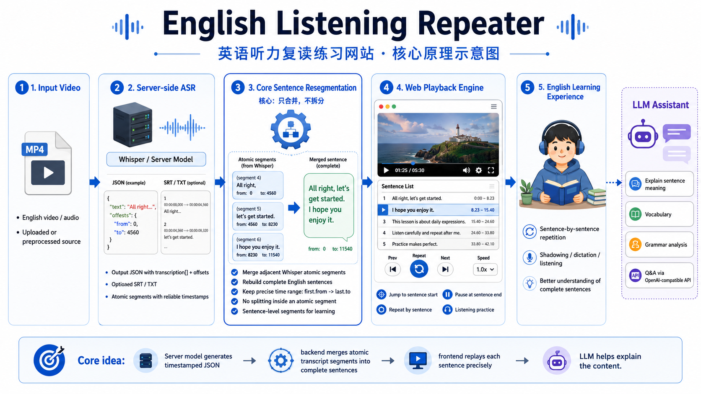
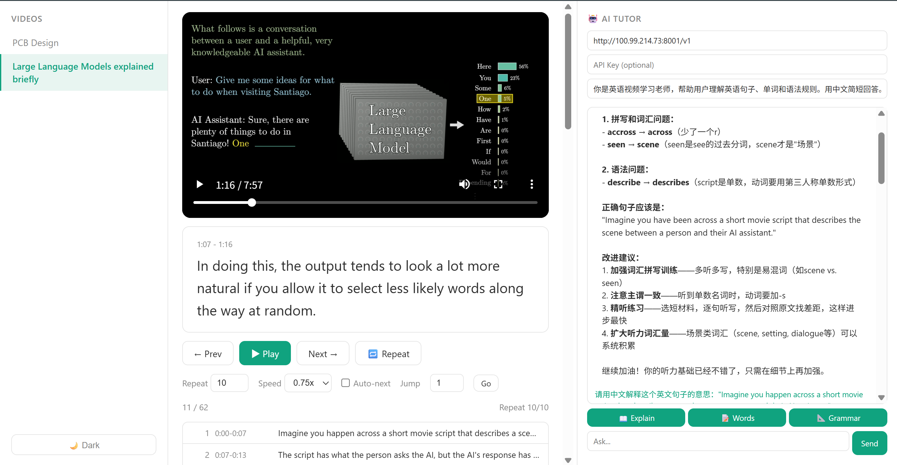
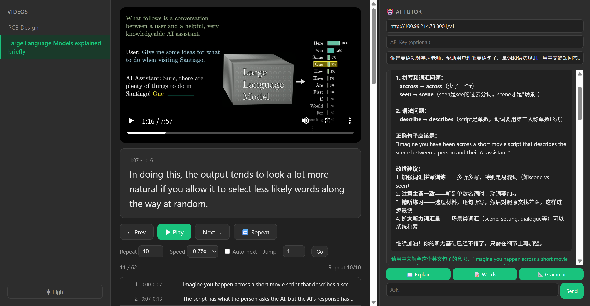

# English Listening Repeater

英语听力复读练习网站。读取已转录的英文视频，按完整句子生成播放区间，支持逐句复读，并集成 AI 辅助学习（句意解释、关键词和语法分析）。



<p align="center">图 1 — 项目原理图</p>



<p align="center">图 2 — 网页界面</p>



<p align="center">图 3 — 网页界面</p>

## 快速启动

```bash
cd D:\EnglishWeb
py -3 -m venv .venv
.\.venv\Scripts\python.exe -m pip install -r requirements.txt
.\.venv\Scripts\python.exe -m uvicorn app.main:app --host 0.0.0.0 --port 8001
```

浏览器访问 `http://127.0.0.1:8001`。局域网内其他设备访问 `http://<本机IP>:8001`。

## 项目结构

```text
EnglishWeb/
├── app/                        # FastAPI 后端
│   ├── main.py                 # FastAPI 入口，路由注册
│   ├── config.py               # 配置：视频源目录、服务端口
│   └── api/
│       └── routes.py           # 全部 API + 句子重分段算法
├── static/
│   └── js/app.js               # 播放器、复读逻辑、AI 对话
├── templates/
│   └── index.html              # 单页 UI 与样式
├── tests/                      # 后端算法与前端契约测试
├── data/
│   └── projects/               # 运行时项目缓存
├── downloads/input/            # 视频源文件存放目录
├── images/README/              # README 截图
├── .venv/                      # Python 虚拟环境
├── requirements.txt            # Python 依赖
├── .env                        # 本地环境变量（不提交）
└── README.md
```

### 核心文件说明


| 文件                   | 作用                                                          |
| ---------------------- | ------------------------------------------------------------- |
| `app/main.py`          | FastAPI 应用入口，挂载静态文件、注册路由、配置中间件          |
| `app/config.py`        | 所有可配置参数：视频源目录列表、服务地址、端口                |
| `app/api/routes.py`    | **核心后端** — 视频扫描、句子重分段、视频/字幕服务、API 配置 |
| `static/js/app.js`     | **核心前端** — 播放器控制、句子列表渲染、重复逻辑、AI 对话   |
| `templates/index.html` | 全站唯一页面，ChatGPT 风格三栏布局（视频列表\|播放器\|AI）    |

---

## 添加视频

将处理好的文件放入一个目录，文件命名必须一致：

```text
YourDir/
├── VideoName.mp4      # 视频文件（必需）
├── VideoName.json     # Whisper 转录 JSON
├── VideoName.txt      # 纯文本（可选，用于人工修正断句）
└── VideoName.srt      # 字幕（可选）
```

将 `YourDir` 放在 `downloads/input/` 下，后端会递归扫描所有子目录，刷新网页即可自动识别。MP4 与 JSON 推荐使用相同文件名；如果视频存放在项目外部目录，可以通过 `/api/sources` 添加额外来源。

---

## 视频处理流程

```text
MP4 视频
  │
  ├─ ffmpeg 提取音频 → 16kHz WAV
  │
  ▼
Whisper large-v3 (HuggingFace: ggml-large-v3.bin)
  │  输出: result.json (transcription 数组 + offsets 毫秒时间戳)
  │        result.srt  (字幕文件)
  │
  ├─ 人工整理: result.txt (按句号正确断句)
  │
  ▼
网站后端 resegment_sentences() (app/api/routes.py)
  │  TXT/JSON 全局有序对齐
  │  逐词时间戳 → 按词确定句界
  │  仅段时间戳 → 句界在段内时按词长比例插值
  │  时间异常或文本不匹配 → 拒绝猜测/安全回退
  │
  ▼
前端播放器 (static/js/app.js)
  │  video.currentTime = segment.start
  │  timeupdate → currentTime >= segment.end → pause → repeat
  │
  ▼
逐句复读 + AI 辅助学习
```

### 支持的转录格式

后端按以下优先级读取 JSON 中最细粒度的时间单元。

#### 1. 逐词时间戳（推荐）

Whisper/faster-whisper 开启 word timestamps 后，每个单词都有独立的秒级时间：

```json
{
  "words": [
    { "text": "Imagine", "start": 0.12, "end": 0.48, "probability": 0.98 },
    { "text": "you",     "start": 0.48, "end": 0.62, "probability": 0.99 }
  ]
}
```

也支持将 `words` 嵌套在 `segments[]` 或 `transcription[]` 中。逐词格式可以直接使用一句话中第一个和最后一个单词的时间戳，是最精确的输入格式。

#### 2. Whisper 原子段时间戳

没有逐词时间戳时，Whisper 按停顿切分为原子段（通常 200~400 段），每段包含文本和毫秒时间戳：

```json
{
  "transcription": [
    {
      "text": " All right, we're going to introduce you guys...",
      "offsets": { "from": 0,     "to": 4560 },
      "timestamps": { "from": "00:00:00,000", "to": "00:00:04,560" }
    },
    {
      "text": " So for a lot of you, this will be the first time...",
      "offsets": { "from": 4800,  "to": 8460 }
    }
  ]
}
```

`offsets.from` / `offsets.to` 是毫秒级音频时间戳。原子段内部没有真实的逐词时间；当语义句界落在段内时，后端会根据段内单词的字符长度比例估算句界，并把结果明确标记为 `interpolated_segment`。

#### 3. 已处理的播放区间

如果 JSON 顶层已经是包含 `start`、`end`、`text` 的数组，后端不会重新匹配文本，只校验并规范化已有区间。

### 核心算法：句子重分段

Whisper 按音频停顿切段，不按语义。例如：

```text
段4: [11.8s-16.2s] "And so there's a couple of important concepts
                     that you'll want to kind of understand"
段5: [16.2s-22.3s] "and some sort of basic terminology..."
```

这两个段实际是一个完整句子，需要合并。

算法入口是 `app/api/routes.py` 中的 `resegment_sentences()`，完整流程如下。

#### 第一步：构建有序时间单元

后端优先读取 `words`。没有逐词数据时，使用 `transcription` 或 `segments` 中的原子段。每个时间单元统一为：

```python
{"text": str, "start": seconds, "end": seconds}
```

段级 JSON 的毫秒值会在这里转换为秒。原始段的首尾时间保持不变；只有句界落在原始段内部且缺少逐词时间戳时，才使用显式标记的插值边界。

#### 第二步：规范化文本

TXT 用来提供人工整理后的句子和标点。规范化过程会：

- 合并多余空白和换行；
- 使用 `casefold()` 忽略大小写；
- 统一英文直引号和弯引号；
- 保留单词顺序和重复词；
- 按 `.?!` 断句，并保留句末引号。

如果没有 TXT，则直接使用 JSON 中按时间顺序拼接的文本。

#### 第三步：全局、有序对齐

旧算法会在当前位置附近搜索 1~5 个段，并用“单词集合重合率”打分。集合会丢失词序和重复次数，局部搜索一旦错位还会影响所有后续句子。

新算法把完整 TXT 和完整 JSON 展开为两个单词序列，通过 `SequenceMatcher(autojunk=False)` 查找全局、有序的匹配块：

```python
target_words = normalize(txt)
source_words = normalize(json_units)
matches = SequenceMatcher(None, target_words, source_words, autojunk=False)
```

每个 TXT 单词只会映射到顺序一致的 JSON 单词，后面的句子不能重新匹配前面已经出现过的音频。重复词也按出现顺序保留，不再被 `set()` 去重。

每句话会计算两个指标：

- `coverage = 已匹配目标词数 / 目标句词数`；
- `precision = 已匹配目标词数 / 对应 JSON 词区间长度`。

1~2 个词的短句要求完整匹配；较长句子的 `coverage` 至少为 `0.55`，`precision` 至少为 `0.50`。置信度使用二者的调和平均值。

如果整个 TXT 的匹配覆盖率低于 `0.70`，说明 TXT 可能属于另一个视频或版本已经过期。此时后端放弃 TXT，使用 JSON 自身文本重新断句，避免错误句子改变音频边界。

#### 第四步：生成播放边界

每句话通过已对齐的第一个和最后一个源单词找到对应时间单元：

```python
start = units[first_unit]["start"]
end = units[last_unit]["end"]
```

- 逐词模式：`first_unit` 和 `last_unit` 是单词，可以得到词级边界；
- 原子段模式：如果句界落在两个原子段之间，直接使用真实段边界；如果句界落在段内，则按段内单词的字符权重插值，防止多个句子因为共享原始段而链式合并；
- 所有输出保持时间单调，不允许后一句回到前一句的时间范围。

段内插值公式：

```python
token_weight = max(len(normalized_token), 1)
boundary = segment.start + segment.duration * (
    cumulative_token_weight / total_token_weight
)
```

同一个句界两侧使用同一累计权重，因此前一句的 `end` 等于后一句的 `start`，不会重叠或留下人为间隙。

返回数据中的 `text` 来自 TXT（或安全回退后的 JSON），`raw_text` 保存该时间范围内的 JSON 原文，方便排查文本差异。`boundary_source` 标识边界来源：

- `word_timestamps`：逐词时间戳；
- `segment_timestamps`：句界恰好位于原子段边缘；
- `interpolated_segment`：句界位于原子段内部，按词长比例估算；
- `processed`/`merged`：已有处理结果。

插值区间的文本对齐置信度会乘以 `0.85`，用于区分真实时间边界和估算边界。

#### 第五步：失败关闭与时间校验

算法遵循“宁可少一句，也不播放错误音频”的原则。以下区间不会被猜测修复，而是记录 warning 并跳过：

- `start/end` 不是有限数字；
- `start < 0` 或 `end <= start`；
- 相对上一个区间倒退超过 `0.05s`；
- 区间短于 `0.05s`；
- 至少 5 个词且平均语速超过 `8 words/s`。

某个异常区间被跳过后，全局对齐不会丢失位置，后续正常句子仍然可以继续输出。

### 设计原则：精确边界优先，插值边界显式标记

如果 JSON 提供 `words[].start/end`，始终使用真实的单词边界。只有 `transcription[].offsets` 时，原始段首尾仍是精确边界，段内句界只能估算。

- ✅ **合并**：选段 4+5 → `start = 段4.from, end = 段5.to` → 时间戳精确
- ⚠️ **段内断句**：句号后还有下一句开头 → 按段内词长比例插值 → 时间近似并降低置信度

这样可以避免一个原始段同时包含“上一句结尾 + 下一句开头”时发生链式合并。若业务要求所有边界都绝对来自 Whisper，则必须提供逐词时间戳 JSON。

### 为什么不合并音频文件

`resegment_sentences()` 合并的是播放区间，不是 MP4/WAV 文件。前端始终播放原始视频：

```javascript
video.currentTime = segment.start;
video.play();
// currentTime >= segment.end 时暂停或重复
```

只要 `start/end` 来自同一份 JSON 的连续时间轴，浏览器自然会播放首尾边界之间的全部音频。生成新的音频切片既没有必要，还会引入编码延迟、文件管理和边界误差。

### 正确性的边界

逐词模式下，所有句界都直接来自 JSON。段级模式下，原始段首尾来自 JSON，段内句界是单调、可追踪的近似值，并通过 `boundary_source` 和较低置信度公开标记；算法不会把低匹配度 TXT 强行放到其他音频位置。

它不能保证 Whisper 的原始识别和时间戳相对于真实人声绝对正确。如果源 JSON 本身损坏，文本无法反推出真实音频时间；此时只能重新运行带逐词时间戳的 Whisper/forced alignment，或者跳过异常区间。

### 已知局限

1. 最终精度仍取决于 Whisper 原始时间戳；损坏的时间戳只能拒绝，不能从文本还原
2. 只有段级时间戳时，段内句界是按词长比例插值的近似值，不等同于真实逐词对齐
3. `.txt` 与 JSON 差异过大时会自动使用 JSON 文本，避免把句子匹配到错误音频

### 回归测试

测试覆盖逐词边界、段内多句插值、链式共享段拆分、无关 TXT 回退、异常时间过滤、重复词顺序和句末引号：

```powershell
python -m unittest discover -s tests -v
```

---

## AI 助手

右侧面板集成 AI 辅助学习，可连接实现 OpenAI Chat Completions 格式的本地或云端 API：

- **Explain** — 用中文解释当前句子含义
- **Words** — 提取关键词和短语的中文释义
- **Grammar** — 分析语法结构

配置方式：

- **API URL**：填写 Base URL，程序会自动追加 `/chat/completions`（如 `http://localhost:8000/v1`、`https://api.deepseek.com`）
- **API Key**：可选，云端 API 需填入，本地 API 留空
- **Model**：可选；填写时请求会携带 `model`，留空时不发送该字段，由服务端选择默认模型

典型配置：

| 场景 | API URL | API Key | Model |
| ---- | ------- | ------- | ----- |
| 支持默认模型的本地服务 | 本地服务的 Base URL | 留空 | 留空 |
| 要求模型 ID 的本地服务 | 本地服务的 Base URL | 按需填写 | 填写服务公布的模型 ID |
| OpenAI-compatible 云服务 | 厂家提供的 Base URL | 填写有效密钥 | 填写厂家提供的模型 ID |

如果出现错误，可优先按状态码排查：`401/403` 通常是密钥或权限问题，`400/422` 通常是模型名或请求参数问题，`404` 通常是 Base URL 不正确，`429` 通常是额度或频率限制。

API Key 只保留在当前页面中，不会写入项目配置或浏览器本地存储。不要把密钥提交到代码、截图或聊天记录。

---

## 技术栈


| 层       | 技术                                 |
| -------- | ------------------------------------ |
| 后端框架 | FastAPI + uvicorn                    |
| 前端     | 原生 JavaScript（无框架）            |
| 样式     | CSS 变量 + 深色/浅色主题             |
| 转录输入 | Whisper JSON/TXT/SRT                  |
| AI 接口  | OpenAI-compatible`/chat/completions` |
| 部署     | 单文件 Python 进程，局域网即可用     |
